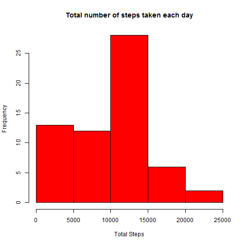
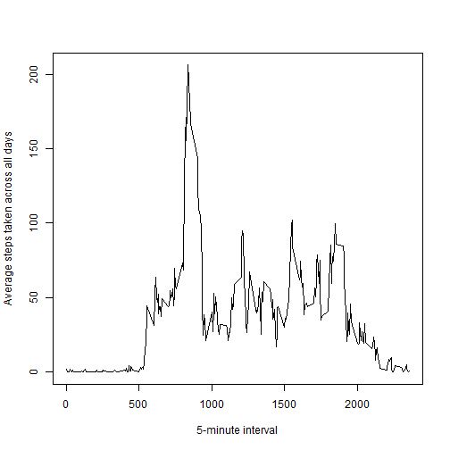
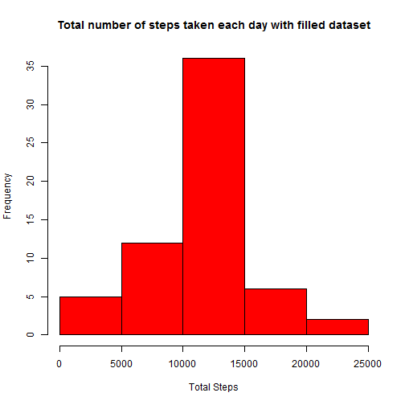
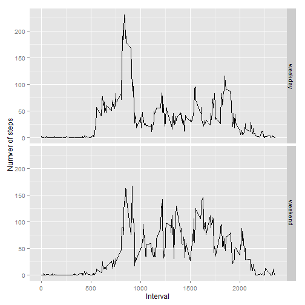

# Reproducible Research Course - Assignment 1

From the assignment introduction: "It is now possible to collect a large amount of data about personal movement using activity monitoring devices such as a Fitbit, Nike Fuelband, or Jawbone Up. These type of devices are part of the "quantified self" movement - a group of enthusiasts who take measurements about themselves regularly to improve their health, to find patterns in their behavior, or because they are tech geeks. But these data remain under-utilized both because the raw data are hard to obtain and there is a lack of statistical methods and software for processing and interpreting the data.

This assignment makes use of data from a personal activity monitoring device. This device collects data at 5 minute intervals through out the day. The data consists of two months of data from an anonymous individual collected during the months of October and November, 2012 and include the number of steps taken in 5 minute intervals each day.""


```r
library(knitr)
opts_chunk$set(echo=TRUE, results="asis")
```
## Loading and preprocessing the data


```r
activity<-read.csv("activity.csv", stringsAsFactors = FALSE, na.strings = "NA")
```

## What is mean total number of steps taken per day?

- Calculate the total number of steps taken per day 

```r
    library(dplyr)
```

```
## 
## Attaching package: 'dplyr'
## 
## The following objects are masked from 'package:stats':
## 
##     filter, lag
## 
## The following objects are masked from 'package:base':
## 
##     intersect, setdiff, setequal, union
```

```r
    activity_by_date<-group_by(activity, date)
    steps_by_date<-summarize(activity_by_date, sum(steps, na.rm=TRUE))
    colnames(steps_by_date)<-c("date", "total_steps")
```

- plot a histogram of the total number of steps taken each day

```r
    hist(steps_by_date$total_steps, xlab="Total Steps", main="Total number of steps taken each day", col="red")
```

 

- Calculate and report the mean and median of the total number of steps taken per day

```r
    mean_total_steps_per_day<-mean(steps_by_date$total_steps, na.rm=TRUE)
    median_total_steps_per_day<-median(steps_by_date$total_steps, na.rm=TRUE)
```
Mean is 9354.2295082 and median is 10395

## What is the average daily activity pattern?

- time series plot of the 5-minute interval (x-axis) and the average number of steps taken, averaged across all days (y-axis)

```r
    activity_by_interval<-group_by(activity, interval)
    steps_by_interval<-summarize(activity_by_interval, mean(steps, na.rm=TRUE))
    colnames(steps_by_interval)<-c("interval", "steps_avg")
    #plot time series of the 5-minute interval (x-axis) and the average number of steps taken, averaged across all days (y-axis)
    plot(steps_by_interval$interval, steps_by_interval$steps_avg, type="l", xlab="5-minute interval", ylab="Average steps taken across all days")
```

 

- Find the maximum number of steps

```r
max_steps<-steps_by_interval[which.max(steps_by_interval$steps_avg), ]
```

On average across all the days in the dataset, interval 835 has the maximum number of steps (206.1698113 steps) 

## Imputing missing values

- Calculate and report the total number of missing values in the dataset


```r
  #total number of rows with NA values
  rcount<-nrow(activity[is.na(activity$step),])
```
There are 2304 rows with missing values

-  Filling in all of the missing values in the dataset: use the mean of 5-minute interval across all days in the dataset to fill in missing values

```r
    m<-merge(activity, steps_by_interval, by = "interval")
    m$steps<-ifelse(is.na(m$steps), m$steps_avg, m$steps)
    filled_activity<-data.frame(steps = m$steps, date=m$date, interval=m$interval) 
```

- histogram of the total number of steps taken each day with filled-in dataset

```r
    activity_by_date1<-group_by(filled_activity, date)
    steps_by_date1<-summarize(activity_by_date1, sum(steps))
    colnames(steps_by_date1)<-c("date", "total_steps")
    hist(steps_by_date1$total_steps, xlab="Total Steps", main="Total number of steps taken each day with filled dataset", col="red")
```

 

- Calculate and report the mean and median of the total number of steps taken per day using filled-in dataset

```r
    mean_total_steps_per_day1<-mean(steps_by_date1$total_steps)
    median_total_steps_per_day1<-median(steps_by_date1$total_steps)
```
Mean is 1.0766189 &times; 10<sup>4</sup> and median is 1.0766189 &times; 10<sup>4</sup>

## Are there differences in activity patterns between weekdays and weekends?

- Create a new factor variable in the dataset with two levels - "weekday" and "weekend" indicating whether a given date is a weekday or weekend day.

```r
    library(lubridate)
    activity2<-mutate(filled_activity, wdate = ifelse(wday(filled_activity$date) %in% c(1, 7), "weekend", "weekday"))
    activity_interval_wdate<-group_by(activity2, interval, wdate)
    steps_act_inerval_wdate<-summarize(activity_interval_wdate, mean(steps))
    colnames(steps_act_inerval_wdate)[3]<- "steps_avg"
```

- time series plot of the 5-minute interval (x-axis) and the average number of steps taken, averaged across all weekday days or weekend days (y-axis)

```r
    library(ggplot2)
    g<-qplot(interval, steps_avg, data= steps_act_inerval_wdate, xlab="Interval", ylab="Numver of steps", geom="path", facets=wdate~.)
    print(g)
```

 


